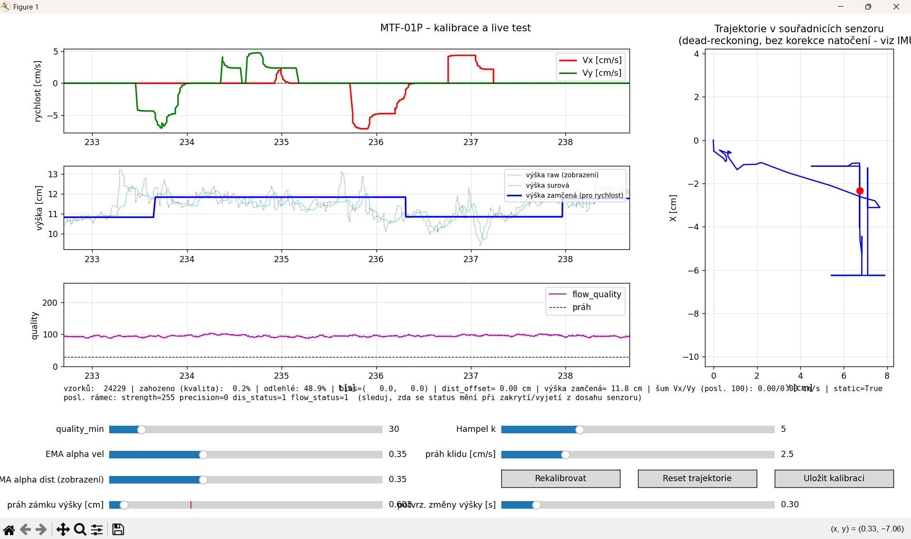
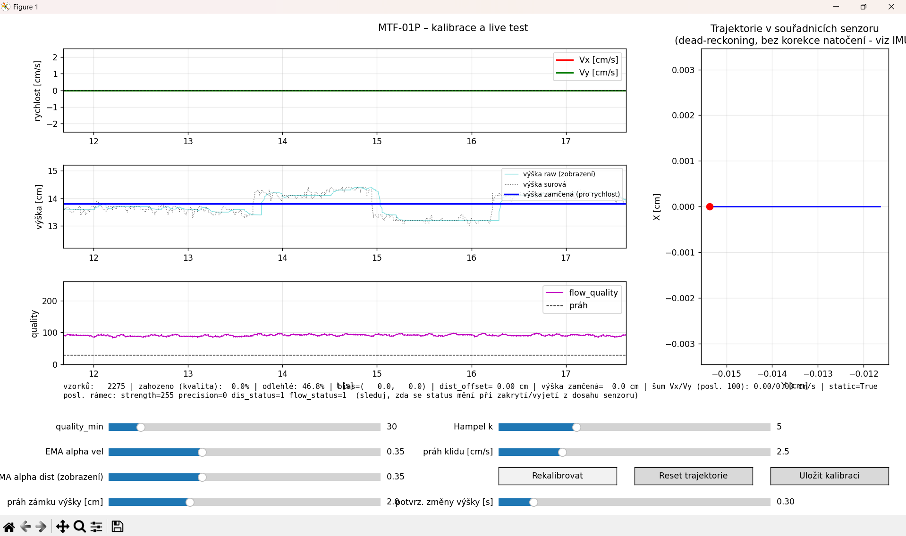
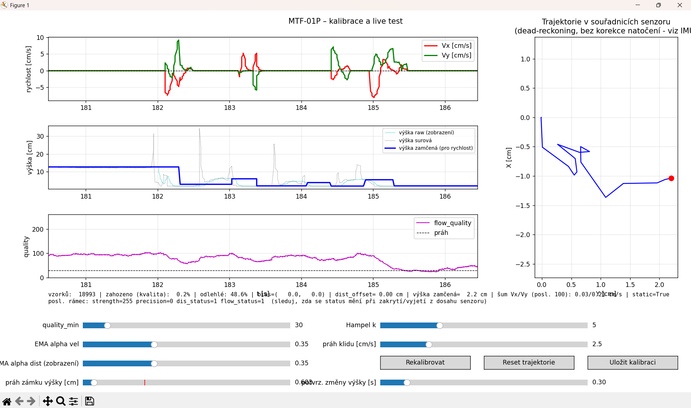

# odometrický modul pro AGV


## 1. Účel

Modul odhaduje rychlost podvozku ve dvou osách (Vx, Vy) z optického flow
senzoru s integrovaným laserovým dálkoměrem. Výška senzoru nad podlahou je
u AGV považována za přibližně konstantní (mění se skokově jen při najetí
na překážku/nerovnost). Výstup je určen jako jeden ze vstupů budoucí
fúze s IMU (heading, kompenzace zrychlení) – sám o sobě neřeší rotaci
podvozku.



## 2. Hardware a připojení

- Senzory: Optical FLow camera PMW 3901, distance ToF
- Rozhraní na RPi: `/dev/ttyAMA0`.
- Uživatel spouštějící skripty musí být ve skupině `dialout`.

## 3. Přehled modulů

| Soubor | Účel |
|---|---|
| `mtf01_link.py` | Parser rámců Micolink (stavový automat + dekódování payloadu). |
| `estimator.py` | Filtrace, kalibrace, ZUPT, výpočet Vx/Vy/výšky a trajektorie. |
| `calib_store.py` | Perzistence kalibrace do `calibration.json`. |
| `sensor_node.py` | Produkční headless proces: UART → filtrace → UDP (JSON). |
| `raw_forwarder.py` | Přeposílá syrové Micolink rámce přes UDP (pro vzdálené ladění). |
| `calibration_tool.py` | Grafický kalibrační a diagnostický nástroj (matplotlib). |
| `example_listener.py` | Referenční UDP klient (příjem a parsování výstupu). |


## 4. Algoritmus filtrování (`estimator.py`)

1. **Gating quality** – vzorek s `flow_quality < quality_min` se do filtru
   vůbec nepustí (drží se poslední platná hodnota). Prahuje se pouze podle
   `flow_quality`, ne podle `dis_status`/`flow_status`.
2. **Hampel filtr** (medián + MAD, okno 11 vzorků) – odliší jednorázový
   výpadek/skok od skutečné trvalé změny (např. reálný přejezd hrbolu).
   Do historie filtru se ukládají syrové hodnoty, ne přefiltrované –
   jinak by filtr při trvalé změně „oslepl“ a už by ji nikdy nepustil.
3. **Medián + EMA** – doladění šumu po Hampelu (medián okno 7,
   `ema_alpha_vel`/`ema_alpha_dist`).
4. **Kompenzace výškou** – `Vx = ema_vx * height_m` atd.
5. **ZUPT (zero-velocity update)** – detekce klidu přes RMS (ne
   směrodatnou odchylku – ta by u jízdy konstantní rychlostí mylně
   hlásila klid) posledních `stationary_window` vzorků. V klidu:
   - výstupní Vx/Vy se přiškrtí přesně na 0 (zabraňuje driftu
     integrátoru trajektorie),
   - nulový bod (`bias_x`, `bias_y`) se pomalu doučuje směrem k
     aktuálnímu syrovému flow (kompenzace teplotního/osvětlovacího
     driftu senzoru v čase),
   - doučování má okamžitou pojistku na aktuální (nezprůměrovaný)
     vzorek (`bias_gate_raw`), aby se při rozjezdu z klidu nestihl
     zkazit nulový bod ještě před tím, než ZUPT okno rozjezd rozpozná.
6. **Trajektorie** – dead-reckoning integrací Vx/Vy v souřadnicích
   senzoru. `dt` se počítá z časového razítka senzoru (`time_ms`), ne
   z hodin hostitele – eliminuje jitter OS/vlákna/UDP přenosu.

   Vždy zde bude přítomna integrační chyba, která se resetuje pouze v okamžiku detekce stání.

## 5. Kalibrace

Kalibrace měří v klidu:
- `dist_offset` – korekci na zadanou referenční výšku (`--height`, výchozí 15 cm),
- `bias_x`, `bias_y` – nulový bod optického flow.

Postup:

1. Senzor položit nehybně na referenční výšku nad podlahou (rovná deska,
   žádný pohyb, rovnoměrné osvětlení).
2. Spustit `calibration_tool.py` (viz kap. 8). Po dobu kalibrace (výchozí
   300 vzorků ≈ 3 s) zobrazuje panel `KALIBRACE xx %`.

   

3. Po dokončení kalibrace ověřit v textovém panelu pod grafy:
   - `bias=(x, y)` – v jednotkách raw flow, u klidného senzoru řádově
     jednotky,
   - `dist_offset` – v cm,
   - graf Vx/Vy drží nulu, graf výšky je stabilní kolem referenční
     hodnoty.

4. Vyzkoušet reálný pohyb senzorem (posun v ose X, v ose Y, návrat do
   klidu) a ověřit:
   - že rychlost po pohybu klesne zpět na přesnou nulu (ZUPT),
   - že trajektorie odpovídá směru pohybu (viz omezení v kap. 9).

   

5. Uložit kalibraci tlačítkem **„Uložit kalibraci“** → zapíše se do
   `calibration.json` vedle skriptů.
6. Ověřit, že `sensor_node.py` startuje bez kalibrační fáze a rovnou
   posílá data (viz kap. 7 – automatické načtení).

Prahy filtru (`quality_min`, EMA alfy, Hampel k, práh klidu) lze doladit
za běhu přes slidery a výsledek okamžitě sledovat v grafech – doporučeno
provést při první instalaci na konkrétní podlahu/osvětlení.


Pokud se hodnota kvality dostane pod stanovenou mez, přestane se rychlost brát jako relevantní. Dochází k tomu například při rychlém měnění naměřené výšky, kdy kamera zaznamenává rychlé změny v pixelech, ale pohyb je vlastně nulový:



## 6. Automatické načtení kalibrace

`sensor_node.py` i `calibration_tool.py` čtou/zapisují stejný soubor
`calibration.json` umístěný vedle skriptů. Pokud soubor
existuje, `sensor_node.py` jej při startu načte a **kalibrační fázi
přeskočí** – naběhne rovnou do provozního režimu. Nová kalibrace se
vynutí přepínačem `--recalibrate`.


## 7. Použití nástrojů

### Kalibrace / diagnostika (lokálně na RPi)
```bash
python3 calibration_tool.py --serial /dev/ttyAMA0 --height 15
```

### Kalibrace / diagnostika vzdáleně (jiný stroj v síti)
```bash
# na RPi:
python3 raw_forwarder.py --udp-target 255.255.255.255:12346
# na vzdáleném stroji:
python3 calibration_tool.py --udp-raw 12346
```

### Provozní nasazení (jen výsledná rychlost přes Ethernet)
```bash
python3 sensor_node.py --udp-target 192.168.1.50:12345
```

### Příjem dat kdekoliv v síti
```bash
python3 example_listener.py --port 12345
```

## 8. Formát UDP výstupu (`sensor_node.py`)

Jeden JSON objekt na řádek (newline-terminated), UDP:

```json
{"t": 1699999999.123, "vx": 0.0, "vy": 0.0, "h": 15.1,
 "flow_ok": true, "dist_ok": true, "static": true, "q": 180, "calib": false}
```

| Pole | Význam |
|---|---|
| `t` | čas přijetí na hostiteli [s, unix time] |
| `vx`, `vy` | rychlost [cm/s] |
| `h` | filtrovaná výška [cm] |
| `flow_ok`, `dist_ok` | platnost aktuálního vzorku dle prahu kvality |
| `static` | příznak ZUPT (senzor vyhodnocen jako nehybný) |
| `q` | `flow_quality` posledního vzorku [0–255] |

## 9. Vzdálený přístup přes telnet

Po zapnutí RPi stačí
připojit k PC, spustit `telnet <adresa-rpi>` a **rovnou**, bez jakékoliv
výzvy k přihlášení, psát zkrácené příkazy typu `forward 192.168.60.5:12345`. Žádná trvalá
služba senzoru neběží na pozadí sama, spouští se jen to, co je právě
potřeba, a po Ctrl+C se lze vrátit zpět a spustit něco jiného.

### Předpoklad: trvalá statická IP na `eth0`

Telnet potřebuje, aby RPi mělo na rozhraní k PC (`eth0`) pořád stejnou
adresu. Na přímém spojení RPi–PC (bez routeru) není žádný DHCP server –
pokud je `eth0` nastavené na "získat IP automaticky" (DHCP), po startu
~45 s marně čeká na DHCP, selže a rozhraní zůstane úplně vypnuté
(„disconnected“), dokud ho někdo ručně neaktivuje. Proto:

```bash
sudo bash scripts/setup_eth0_static.sh 192.168.60.101/24
```

Skript založí čistý NetworkManager profil `eth0-static` s pevnou IP bez
závislosti na DHCP (`ipv4.method: manual`) a případné starší/konkurující
profily pro `eth0` vypne (`autoconnect no`), ať si nekonkurují o stejné
rozhraní. Adresa/prefix jako parametr je volitelný, výchozí je
`192.168.60.101/24`.


### Jednorázové zapnutí telnetu (na RPi)

```bash
sudo bash scripts/setup_telnet.sh
```

Skript:
- nainstaluje telnet server (`inetutils-telnetd`) a zaregistruje ho jako
  systemd socket (`telnet.socket` na portu 23) s aktivací **při startu
  systému** – není potřeba nic ručně spouštět po každém rebootu,
- vytvoří neprivilegovaný účet **`mtfop`** (bez použitelného hesla –
  `passwd -l`, přihlásit se jím přímo přes ssh/su/konzoli nejde),
- nakonfiguruje telnetd, aby místo obvyklého `/bin/login` spustil
  `scripts/setup_telnet.sh`-generovaný root-drop wrapper
  (`/usr/local/sbin/mtf-telnet-autologin`), který ihned (dřív, než se
  cokoliv od klienta přečte) přepne na účet `mtfop` a spustí
  `mtf_shell.py` – žádná autentizace, žádný `login:` prompt.

### Připojení z PC

```bash
telnet <hostname-rpi>.local      # díky avahi/mDNS, např. telnet of.local
# nebo přímo přes IP:
telnet 192.168.60.101
```

Spojení se otevře rovnou do menu, bez výzvy k přihlášení:

```
MTF-01P – rychlé spouštění nástrojů. Napiš 'help' pro nápovědu.
mtf> forward 192.168.60.5:12346
Přeposílám raw Micolink rámce -> 192.168.60.5:12346
...
^C
mtf> sensor 192.168.60.5:12345
Kalibrace za klidu, počáteční výška se odhadne ze senzoru, drž senzor nehybně...
...
mtf> exit
```

Přehled příkazů:

| Příkaz | Ekvivalent | Poznámka |
|---|---|---|
| `sensor <ip:port> [výška_cm]` | `sensor_node.py --udp-target ... [--height ...]` | bez výšky auto-odhad ze senzoru (kap. 6) |
| `forward [ip:port]` | `raw_forwarder.py [--udp-target ...]` | bez ip:port výchozí broadcast |
| `listen <port>` | `example_listener.py --port ...` | |
| `calib [výška_cm]` | `calibration_tool.py --serial /dev/ttyAMA0 [--height ...]` | potřebuje grafické okno (DISPLAY) |
| `calib-remote <port>` | `calibration_tool.py --udp-raw ...` | |
| `help`, `?` | – | nápověda |
| `exit`, `quit` | – | odhlásit |

Běžící nástroj se ukončí **Ctrl+C** – vrátí se `mtf>` prompt a jde spustit
další příkaz (`calib` potřebuje X displej, takže se přes telnet typicky
nepoužije – vhodné spíš lokálně na RPi s připojeným monitorem).

### Plný shell (mimo pevnou sadu příkazů menu)

Bash přes telnet není k
dispozici (nemá se přes koho autentizovat). Pro cokoliv mimo pevnou
sadu příkazů (editace souborů, `git`, ruční ladění, instalace balíčků,
...) nutno použít SSH pod účtem, pod kterým projekt běží:

```bash
ssh <username-rpi>@<hostname-rpi>.local
cd /home/<username-rpi>/of_sensor/mtf-01p
./mtfctl.sh sensor --udp-target 192.168.1.50:12345
```

SSH je heslem chráněné a šifrované (`openssh-server` je na RPi již
nainstalován a aktivní).

### Bezpečnostní poznámka

Telnet menu nemá žádnou autentizaci ani šifrování. Kdokoliv, kdo se
po síti dostane na port 23 tohoto RPi, může bez ověření spouštět
`sensor`/`forward`/`listen`/`calib` s libovolnými síťovými cíli (typicky
přesměrovat data senzoru jinam, nebo si je nechat poslat sobě). Účet
`mtfop`, pod kterým vše běží, nemá heslo a nemá být použit k ničemu
jinému – přesto jde jen o spouštění pevně dané sady skriptů projektu, ne
o obecný shell.

Toto řešení je úmyslně takhle jednoduché a je určeno jen pro přímé,
fyzicky důvěryhodné spojení RPi–PC (servisní/laboratorní účel) – nikdy
ne pro nasazení ve sdílené síti nebo na internetu. Pokud RPi bude
zároveň připojen k síti s dalšími zařízeními, je dobré zvážit alespoň omezení
přístupu na port 23 firewallem (např. `ufw`) jen z adresy servisního PC.

## 10. Známá omezení

- Trajektorie nemá korekci natočení. Vx/Vy jsou integrovány přímo v
  souřadnicích senzoru (osa X = dopředu, Y = do strany dle montáže).
  Pokud se AGV při jízdě otáčí, vykreslená trajektorie neodpovídá
  skutečné dráze v globálním souřadném systému – to vyžaduje fúzi s
  headingem z IMU, která je mimo rozsah tohoto modulu.
- Minimální funkční výška optického flow dle výrobce ~80 mm, dálkoměr
  2 cm – 8 m.
- ZUPT práh (`stationary_std_thresh`) je kompromis mezi citlivostí na
  pomalý pohyb a stabilitou nuly v klidu – při změně povrchu/osvětlení
  doporučeno přeověřit v `calibration_tool.py`.

## 11. Řešení problémů

| Příznak | Příčina | Řešení |
|---|---|---|
| Nástroj nic nezobrazuje, trvale „KALIBRACE 0 %“ | `dist_ok`/`flow_ok` nikdy `True` (např. špatně nastavený `dis_status_ok`/`flow_status_ok`) | Zkontrolovat syrové hodnoty v textovém panelu, viz kap. 7 |
| Grafy Vx/Vy „poskakují“ i v klidu | Autoscale osy na hodnoty řádu 1e-16 (zaokrouhlovací šum EMA) | Již ošetřeno (`MIN_VEL_SPAN`/`MIN_HEIGHT_SPAN` v `calibration_tool.py`) |
| `PermissionError` na `/dev/ttyAMA0` | uživatel není ve skupině `dialout` | `sudo usermod -aG dialout $USER` a nové přihlášení |
| Po restartu se opět spustí kalibrace | běží se z jiného adresáře / jiná cesta `--calib-file` | Ověřit, že `calibration.json` existuje vedle skriptů, případně zadat `--calib-file` explicitně stejně v obou nástrojích |
| `telnet: Unable to connect to remote host` | telnet služba na RPi neběží nebo neběžela od instalace | Ověřit `systemctl status telnet.socket` na RPi, případně znovu spustit `scripts/setup_telnet.sh` (viz kap. 12) |
| Telnet se připojí, ale hned zase spadne / černá obrazovka bez `mtf>` | `ExecStart` v `telnet@.service` míří na neexistující binárku, nebo root-drop wrapper (`mtf-telnet-autologin`) selhal (např. účet `mtfop` neexistuje) | `systemctl cat telnet@.service` – ověřit, že cesta k `telnetd` (`which telnetd`) opravdu existuje; `sudo journalctl -u 'telnet@*' -n 50` na RPi (instance bez `-` na začátku `ExecStart` teď ukáže i chybu execu, ne jen tiché "Deactivated"), případně znovu spustit `scripts/setup_telnet.sh` (viz kap. 12) |
| Po restartu RPi nejde `telnet <adresa>` navázat vůbec (adresa neodpovídá) | `eth0` čekalo na DHCP, které na přímém spojení RPi-PC není, a zůstalo "disconnected" | Nastavit trvalou statickou IP: `sudo bash scripts/setup_eth0_static.sh` (viz kap. 12) |
| Přes SSH/`mtfctl.sh` `python3: command not found` / chybí knihovny | špatné PATH nebo se používá jiný Python než ten s nainstalovanými balíčky | Spouštět přes `./mtfctl.sh ...` z adresáře projektu, případně ověřit `python3 -c "import serial, numpy"` |
